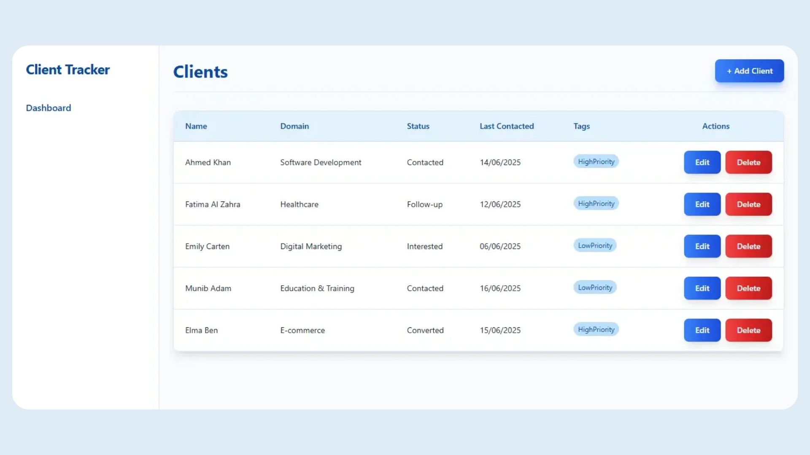

# Client Prospect Tracker (MERN Stack)

A responsive and fully functional MERN stack application for tracking clients — built with **React**, **Express**, **Node.js**, and **MongoDB**.

## 🚀 Features

- Add, edit, and delete client records
- Mobile-responsive layout with table view on desktop and card view on mobile
- Tag support for better client categorization
- Modal-based form UI for managing clients
- Clean, styled interface using Tailwind CSS
- Axios-powered API integration with Express backend and MongoDB database

## 🛠 Tech Stack

- **Frontend**: React, Tailwind CSS, Axios
- **Backend**: Node.js, Express
- **Database**: MongoDB (Mongoose)
- **API**: RESTful APIs for CRUD operations

## 📸 UI Preview

